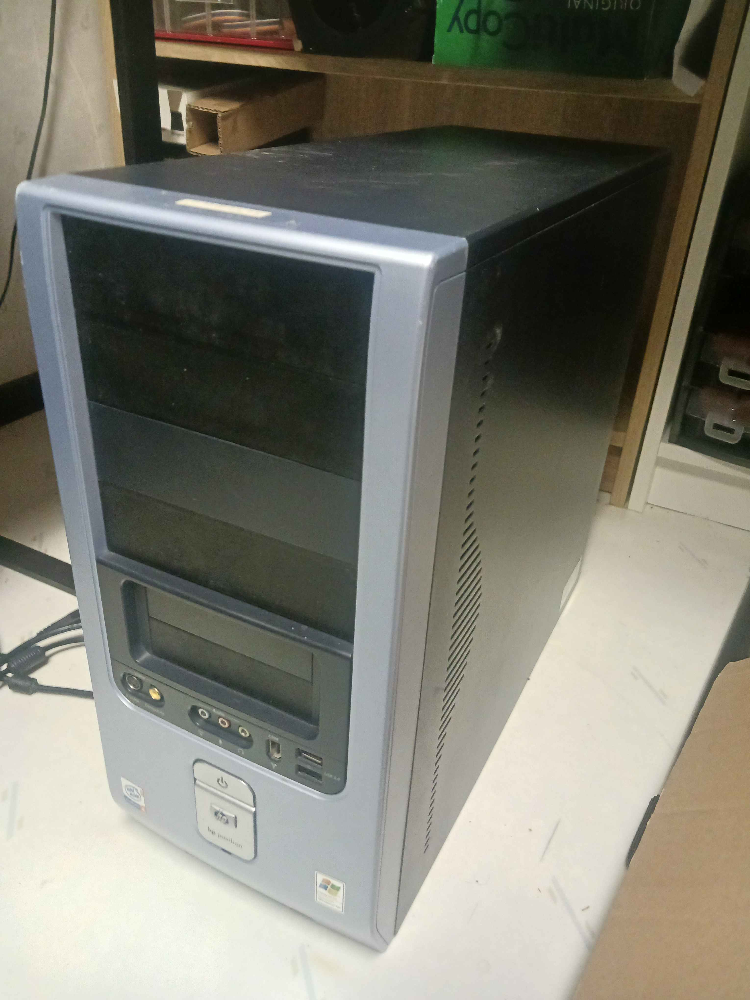
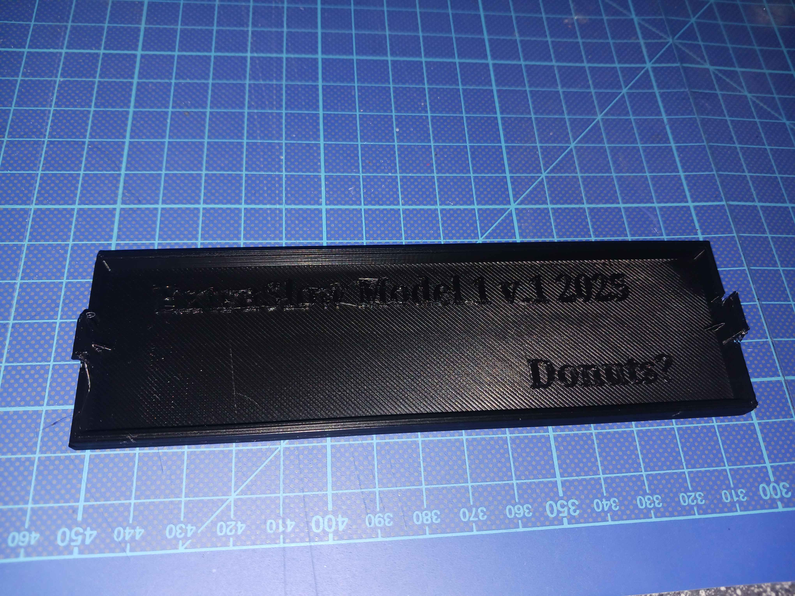
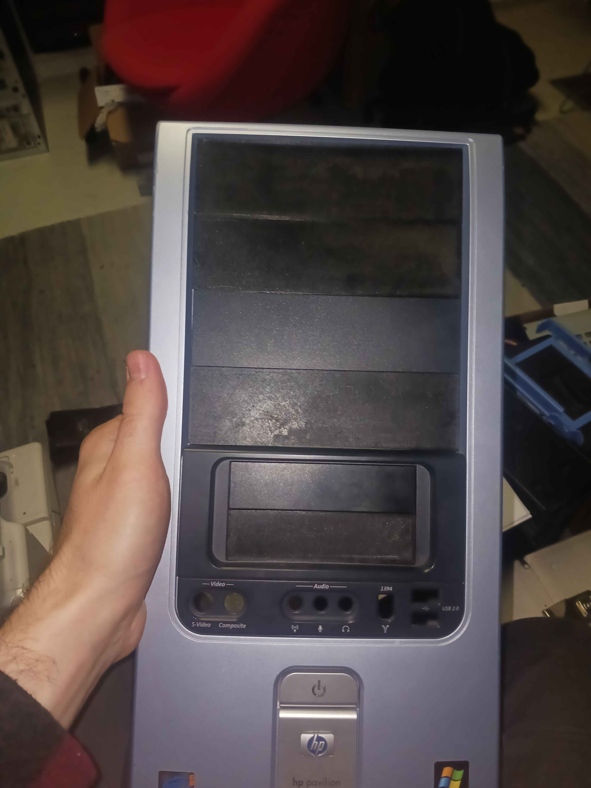
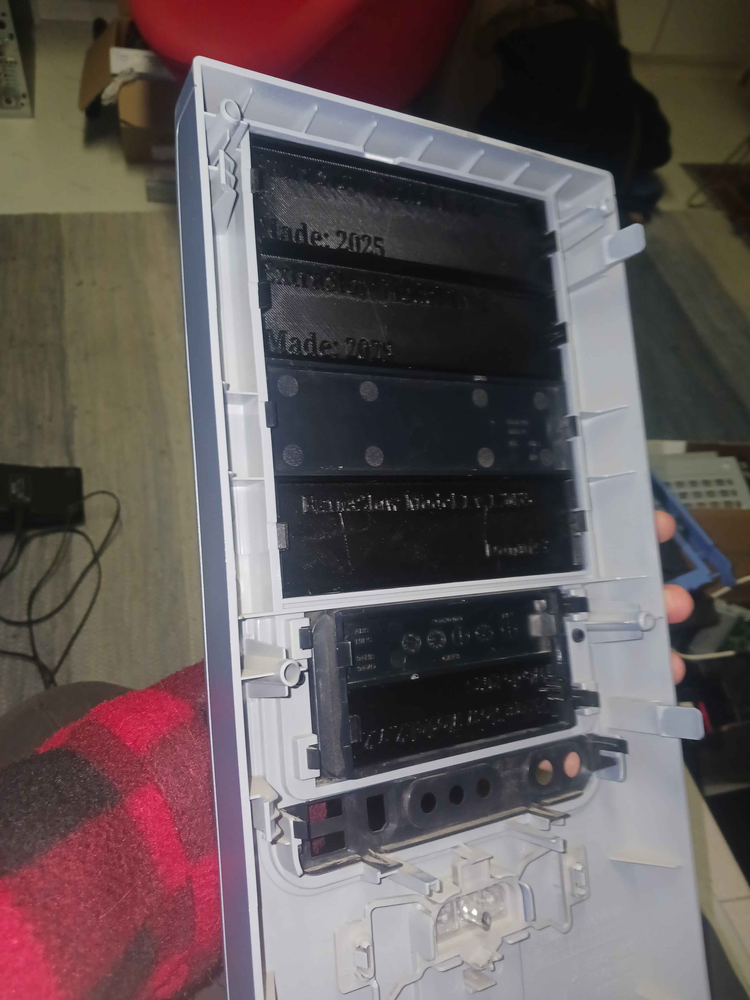

I made these during December of 2025 to cover up holes in a PC case due to removing the CD readers/burners previously there. The PC case in question was a **HP Pavilion D4100Y tower case**, but only one panel of each kind was still with the case itself. So I measured up, designed a copy, and printed more of them at home on a *Creality Ender 3*. 
pretty generic settings; 
- support enabled, 
- 0.16mm layer height,
- 20% infill (but the models are solid),
- 60 degC print bed
- 200 degC nozzle,
- 1.75mm PLA (matte black)

Feel free to use the files. Below are some  pictures of my results.

*The full case, with new panels installed*

*An image of the first prototype panel (v.1)*

*View of front bezel with 4 printed panels installed (and the two original ones)*

*Inside view of the front bezel, with the new panels installed*

P.S. if for some reason you want to buy one of these front bezels, I found [this site](https://www.impactcomputers.com/bezels/hp-front-main-bezel-assembly-5042-8811) selling them