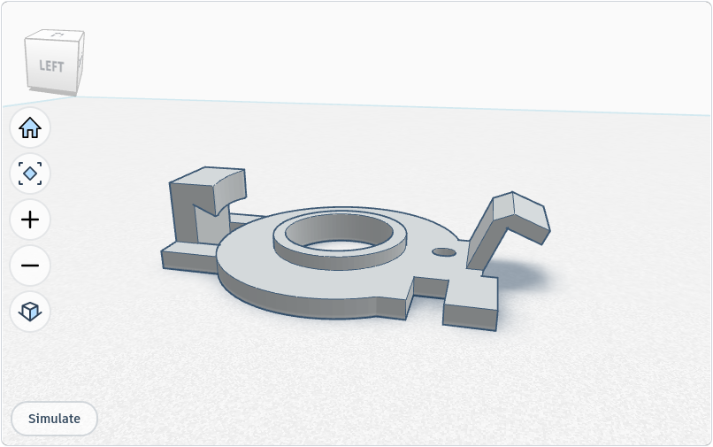
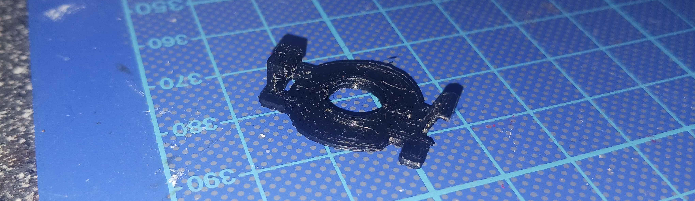
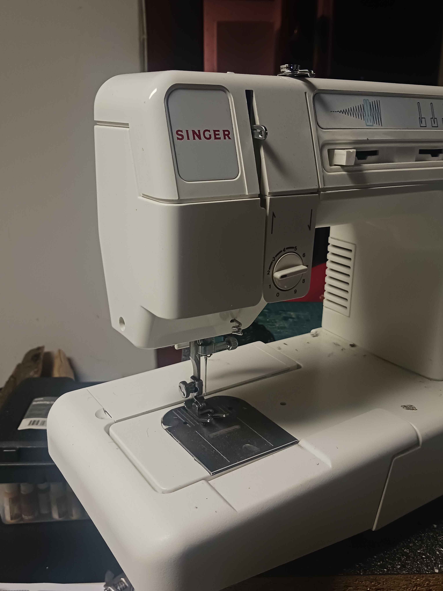

I worked on trying to save a damaged **Singer 9802c** sewing machine during summer or 2025. A main issue being that the needle had shifted out of line to the side, trying to stick *through* the metal case beside the hole upon lowering. Of course that broke a few needles, leading to the machine being discarded. After some fault checks, I found that a specific part capping off and holding the needle arm in place during movement *(didn't manage to find the exact name of the part)* had been damaged. So, I designed a replacement. It sucessfully printed (on the second try), with default settings for my **Creality Ender 3**, using PLA. I did install the part, but didn't really see much change, and the error proved to be fixable by adjusting a neatby screw instead. But technically the printed part was less damaged than the original one. Anyhow; here it is if anyone else ever happens to need this niche and very specific part.

*View of the part in TinkerCAD*

*Image of the part after having been printed in PLA*

*Schematic of the part's location within the sewing machine*

*Image of the Singer 9802c*