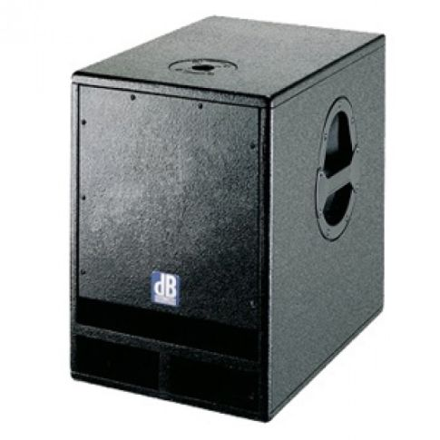
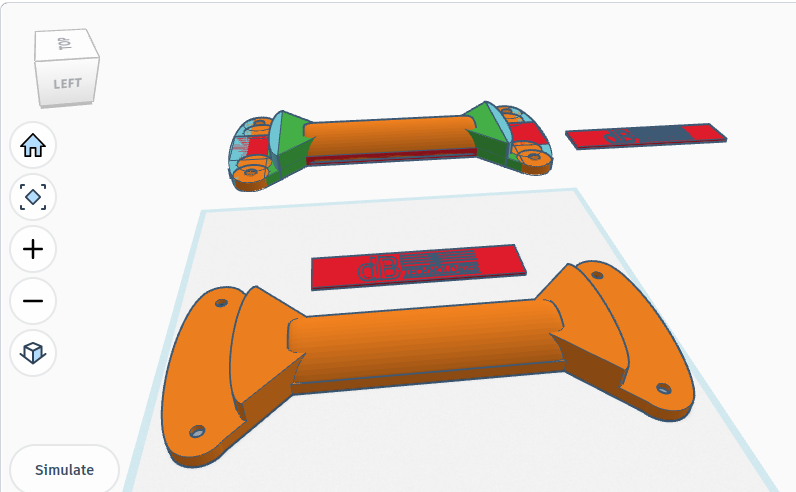

# dB Opera SUB12 handle

So, I was approached by a friend that broke one of their speakers' handles, or it was originally missing, I don't know. Either way; I signed up to design him a copy of the one remaining handle, and print. So, now during May of 2026 I drafted a copy of the side panel-handle to the original **dB Technologies Opera SUB12**. And of course printed it too on my *Creality Ender 3*.

## Creality Ender 3 settings

- support enabled (default, zig-zag)
- 0.16mm layer height
- 70% infill (handle needs extra strength)
- 60 degC print bed
- 200 degC nozzle
- 1.75mm PLA (matte black)

## Images

Feel free to use the files. Below are some  pictures of my results.

 
*The full speaker, with handle visible on the side panel*

 
*An image of the original handle outside*

 
*An image of the original handle inside*

 
*Draft for the handle, finished design in TinkerCAD*

 
*The printed handle*

P.S. I found a site selling the speakers in question: [this site](https://www.wwave.com.au/db-opera-sub-12-subwoofer.html)
